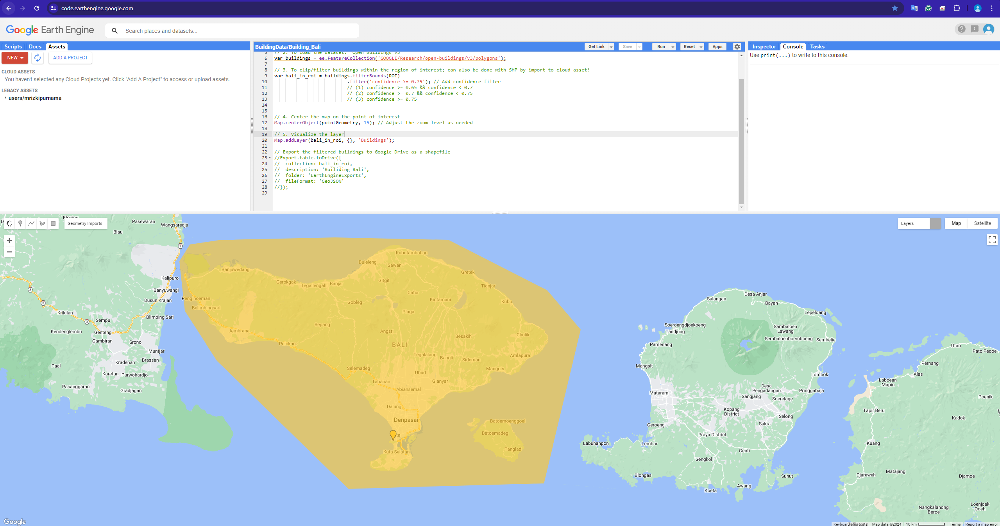

# To extract building-data from "Open Building V3 dataset"

## 1: Introduction

## 2: Material and Methods
### 2.1 Manually define the Region of Interest (ROI)
At first, we can do the analysis for a certain of ROI by defining this as custom polygon in the EE-map in the Code Editor as shown in Figure 1 or you may simply input from your own shapefile!


### 2.2 Dive into the code
#### to extract the ROI based on the defined polygon
```javascript
// 1. To extract the GEOM from the GeometryCollection
var ROI=ee.Geometry(geometry.geometries().get(1)) // ROI (Region of Interest)
var pointGeometry = ee.Geometry(geometry.geometries().get(0));
```
##### to extract from the predefined shapefile (SHP)
```javascript
// 1. To extract the GEOM from the GeometryCollection
var ROI=ee.Geometry(geometry.geometries().get(1)) // ROI (Region of Interest)
var pointGeometry = ee.Geometry(geometry.geometries().get(0));
```

##### to load the dataset 
```javascript
// 2. To load the dataset: "Open Buildings v3"
var buildings = ee.FeatureCollection('GOOGLE/Research/open-buildings/v3/polygons');
```
#### to clip/mask with the defined ROI
```javascript
// 3. To clip/filter buildings within the region of interest; can also be done with SHP by import to cloud asset!
var bali_in_roi = buildings.filterBounds(ROI)
                          .filter('confidence >= 0.75'); // Add confidence for further filtering if needed
```
The confidence level can be used to filter the detections to achieve a certain precision level  
(1) confidence >= 0.65 && confidence < 0.7  
(2) confidence >= 0.7 && confidence < 0.75  
(3) confidence >= 0.75  

#### to visualize on the map
Use this to center your result every time you try to run for another trial (this helped me when I wanted to see the different results of confidence-interval in a specific area within the ROI) 
```javascript
// 4. Center the map on the point of interest
Map.centerObject(pointGeometry, 15); // Adjust the zoom level as needed
```
To visualize the layer, we use this:
```javascript
// 5. Visualize the layer
Map.addLayer(bali_in_roi, {}, 'Buildings');
```
#### to export the data
For further analysis, we may want to export this to GIS Software. Thus, we may want to export the data to GeoJSON!
```javascript
// Export the filtered buildings to (your) Google Drive as a GeoJSON
Export.table.toDrive({
  collection: bali_in_roi,
  description: 'Builiding_Bali',
  folder: 'EarthEngineExports', // to make a new folder on your main GDrive!
  fileFormat: 'GeoJSON'
});
```

## Reference
W. Sirko, S. Kashubin, M. Ritter, A. Annkah, Y.S.E. Bouchareb, Y. Dauphin, D. Keysers, M. Neumann, M. Cisse, J.A. Quinn. Continental-scale building detection from high resolution satellite imagery. arXiv:2107.12283, 2021.  
Link: https://developers.google.com/earth-engine/datasets/catalog/GOOGLE_Research_open-buildings_v3_polygons#description