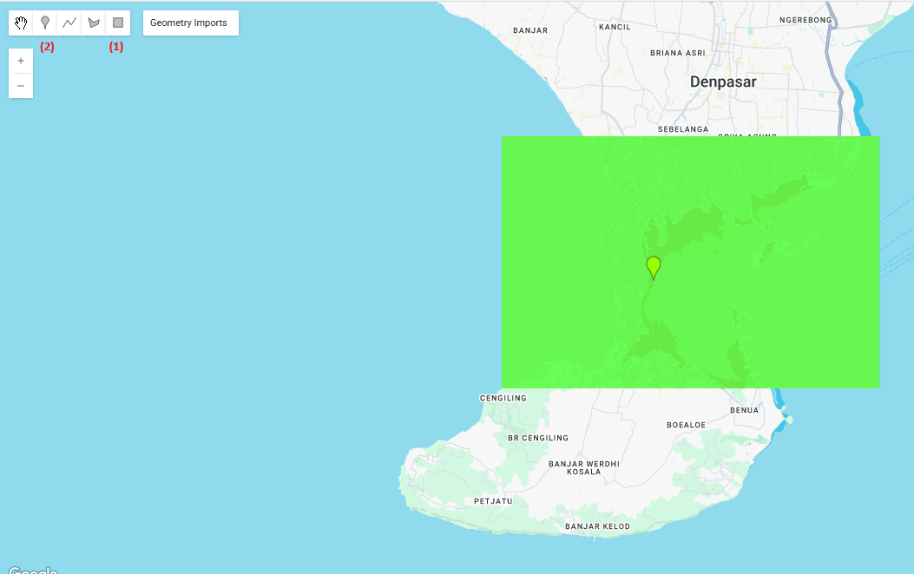

# Deriving Manning’s n from Satellite-derived Land Cover in Google Earth Engine

## 1: Introduction

Hydraulic models often require surface roughness Manning’s n values for different land‐cover types. This workflow shows how to derive a spatially distributed Manning’s n map from Satellite-derived land cover (ESA WorldCover v200) using the Google Earth Engine (GEE).
Note that you can always use any Satellite-derived landcover data provided in the GEE datasets (LANDSAT, MODIS, etc)
This step-by-step guide shows you how to:
1. Load and clip the ESA WorldCover 10 m dataset
2. Visualize its “Map” classification with a custom legend
3. Reclassify each class to a user-defined Manning’s n value
4. Display the reclassified layer with a continuous colormap (e.g. viridis) and a matching legend
5. Export the final Manning’s n raster to your Drive
6. 
## 2: Material and Methods
### 2.1  Define Your Region of Interest (ROI)
To start, define your area of interest by either drawing a polygon directly in the Code Editor or importing a shapefile/FeatureCollection. 
If you draw two geometries [AREA and POINT] named geometry in the GEE panel, you can use them as follows:

Use (1) to first define your area and use (2) as an anchor in the map to zoom-in

### 2.2 Dive into the code
#### to extract the ROI based on the defined polygon
```javascript
// 1. Define ROI
var ROI       = ee.Geometry(geometry.geometries().get(1));
var pointGeom = ee.Geometry(geometry.geometries().get(0));
```

##### Load & Clip the data (ESA WorldCover)
Load and clip the ESA WorldCover image, making sure to adjust the dataset selection as necessary:
```javascript
// 2. Load & clip the ESA WorldCover image [CHANGE/MODIFY ACCORDING BASED ON SELECTED DATASET]
var worldCover = ee.ImageCollection('ESA/WorldCover/v200')
                    .first()
                    .clip(ROI);
```
#### Visualize the “Map” Band
```javascript
// 3. Visualization for the band [CHANGE/MODIFY ACCORDING TO (2)]
var mapVis = {
  bands: ['Map'],
  min: 10,
  max: 100,
  palette: [
    'lightgreen',      // Trees
    'palegoldenrod',   // Shrubland
    'lightyellow',     // Grassland
    'navajowhite',     // Cropland
    'red',             // Built-up
    'lightgray',       // Bare/Sparse veg
    'gray',           // Snow & Ice
    'blue',         // Water
    'mediumaquamarine',// Herbaceous wetland
    'mediumseagreen',  // Mangroves
    'darkolivegreen'   // Moss & lichen
  ]
};
```
Use this to center your result every time you try to run for another trial 
```javascript
// 4. Add original WorldCover layer; center map [DO NOT CHANGE/MODIFY]
Map.centerObject(pointGeom, 15);
Map.addLayer(worldCover, mapVis, 'ESA WorldCover 2020', false); // flag == false to not show directly on the map, but you can still manually activate it in the layer
```

### Add a Legend for ESA WorldCover
```javascript
// 5. Legend for the ESA WorldCover classes (Check the Reference) [CHANGE/MODIFY ACCORDING TO (3)]
// ESA SENTINEL-2: https://developers.google.com/earth-engine/datasets/catalog/ESA_WorldCover_v200
// has 10 bands, hence define the bands in the list below
var classValues  = [10,20,30,40,50,60,70,80,90,95,100]; //change the class values accordingly to BAND values
var classNames   = [
  'Trees','Shrubland','Grassland','Cropland','Built-up',
  'Bare/Sparse veg','Snow & Ice','Water','Herbaceous wetland',
  'Mangroves','Moss & lichen'
]; //change the class palette as well
var classPalette = mapVis.palette;

var legendWC = ui.Panel({
  style: { position: 'bottom-right', padding: '8px', backgroundColor: 'white' }
});
legendWC.add(ui.Label('ESA WorldCover 2020', { fontWeight:'bold', fontSize:'16px' }));
classValues.forEach(function(v, i) {
  var row = ui.Panel({
    widgets: [
      ui.Label('', {
        backgroundColor: classPalette[i],
        padding: '8px',
        margin: '0 6px 0 0'
      }),
      ui.Label(classNames[i] + ' (' + v + ')')
    ],
    layout: ui.Panel.Layout.Flow('horizontal')
  });
  legendWC.add(row);
});
Map.add(legendWC);
```

### Reclassify the Manning's n value based on each landcover type [CHANGE THIS ACCORDINGLY]
```javascript
// 6. Reclassify to custom Manning’s n [CHANGE/MODIFY ACCORDING TO YOUR PREFERRED n VALUES]
// proposed below value is just for example
var manningValues = [
  0.004, //Trees
  0.015, //Shrubland
  0.025, //Grassland
  0.030, //Cropland
  0.060, //Built-up
  0.020, //Bare/Sparse vegetation
  0.025, //Snow & Ice
  0.025, //Water
  0.035, //Herbaceous Wetland
  0.040, //Mangroves
  0.035 //Moss & Lichen
];
//elif default:
var manningImage = worldCover
  .select('Map')
  .remap(classValues, manningValues, /* default */ 0.025)
  .rename('Manning_n');
```

#### to  visualize the manning layer and its legend
```javascript
// 7. Visualize & add the Manning’s n layer 
var manningPalette = ['0FFFFF', '00000F'];
var manningVis = {
  min:     0.0025,
  max:     0.25,   
  palette: manningPalette
};
Map.addLayer(manningImage, manningVis, 'Manning n (reclassified)');

// 8. Legend for the Manning’s n layer
function makeColorBarParams(palette) {
  return {
    bbox: [0, 0, 7, 0.1],
    dimensions: '100x10',
    format: 'png',
    min: 0,
    max: 10,
    palette: manningPalette,
  };
}
var colorBar = ui.Thumbnail({
  image: ee.Image.pixelLonLat().select('longitude').int(),
  params: makeColorBarParams(manningPalette.palette),
  style: {position: 'bottom-left', stretch: 'horizontal', margin: '0px 8px', maxHeight: '24px'},
});
var legendMN = ui.Panel({
  widgets: [
    ui.Label(manningVis.min, {margin: '4px 8px'}),
    ui.Label(
        ((manningVis.max-manningVis.min) / 2+manningVis.min),
        {margin: '4px 8px', textAlign: 'center', stretch: 'horizontal'}),
    ui.Label(manningVis.max, {margin: '4px 8px'})
  ],
  layout: ui.Panel.Layout.flow('horizontal')
});
var legendTitle = ui.Label({
  value: 'Manning n Values',
  style: {fontWeight: 'bold'}
});
var legendPanel = ui.Panel([legendTitle, colorBar, legendMN]);
Map.add(legendPanel);
```

#### Export the data to raster (optional)
This optional step allows for exporting the resulting data to GIS software in GEO TIFF format. The saved data will appear in your Google Drive under "EarthEngineExports". Ensure to adjust the coordinate system and spatial resolution as necessary.

```javascript

// 10. To Exports (OPTIONAL)
// 10.A TO EXPORT THE ORIGINAL LANDCOVER DATA 
 Export.image.toDrive({
   image: worldCover,
   description:    'ESA_WorldCover_2020',
   folder:         'EarthEngineExports',
   fileNamePrefix: 'ESA_WorldCover_2020',
   region:         ROI,
   scale:          10,
   crs:            'EPSG:32750'
 });

// 10.B TO EXPORT THE CLASSIFIED MANNING'S VALUE
Export.image.toDrive({
  image: manningImage,
  description:    'Manning_n_from_WorldCover',
  folder:         'EarthEngineExports',
  fileNamePrefix: 'Manning_n_WorldCover',
  region:         ROI,
  scale:          10,
  crs:            'EPSG:32750'
});

```

## Reference
Zanaga, D., Van De Kerchove, R., Daems, D., De Keersmaecker, W., Brockmann, C., Kirches, G., Wevers, J., Cartus, O., Santoro, M., Fritz, S., Lesiv, M., Herold, M., Tsendbazar, N.E., Xu, P., Ramoino, F., Arino, O., 2022. ESA WorldCover 10 m 2021 v200. (doi:10.5281/zenodo.7254221)
Link: https://developers.google.com/earth-engine/datasets/catalog/ESA_WorldCover_v200
