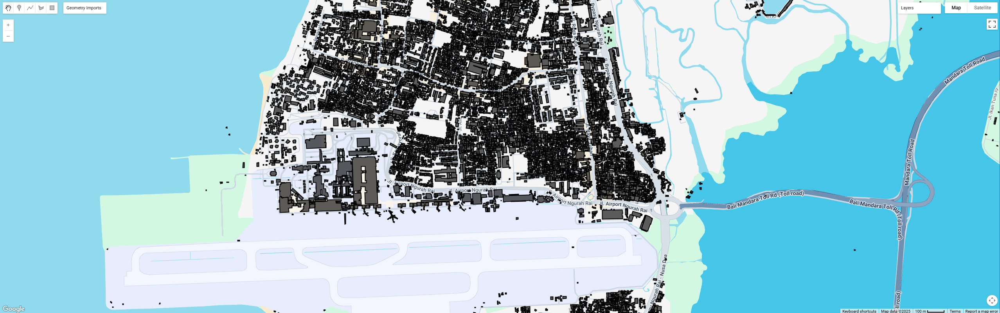

# Deriving Building Polygon Data in Google Earth Engine

## 1: Introduction

In hydraulic modeling, accurate building shape data is essential for further analyses, such as defining flood heights for each building, validating models based on inundation depth, calculating building occupancy ratios, etc.
This step-by-step guide shows you how to:
1. Loading and clipping the Building Polygon V3 dataset
2. Visualizing the building data within your defined region of interest (ROI).
3. Exporting the final building polygon data to your Drive.

This guide is the first step in utilizing building data for advanced analysis, such as determining the heights of each features. For details on that process, please refer to the other tutorial in this folder.

## 2: Material and Methods
### 2.1  Define Your Region of Interest (ROI)
To start, define your area of interest by either drawing a polygon directly in the Code Editor or importing a shapefile/FeatureCollection. 
If you draw two geometries [AREA and POINT] named geometry in the GEE panel, you can use them as follows:

Use (1) to first define your area and use (2) as an anchor in the map to zoom into your map.

### 2.2 Dive into the code
#### to extract the ROI based on the defined polygon
```javascript
// 1. Define ROI
var ROI       = ee.Geometry(geometry.geometries().get(1));
var pointGeom = ee.Geometry(geometry.geometries().get(0));
```

##### Load & Clip the data (Open Building V3)
Load and clip the building shape data, making sure to adjust the dataset selection as necessary:
```javascript
// 2. Load & clip the Building Shape Data
var buildings = ee.FeatureCollection('GOOGLE/Research/open-buildings/v3/polygons');
var buildings_ROI = buildings.filterBounds(ROI)
                          .filter('confidence >= 0.75'); // Add confidence for further filtering if needed
```
The confidence level can be used to filter the detections to achieve a certain precision level  
(1) confidence >= 0.65 && confidence < 0.7  
(2) confidence >= 0.7 && confidence < 0.75  
(3) confidence >= 0.75  
Please check the references for more information

#### Visualize the Map
Use this to center your result every time you try to run for another trial 
```javascript
// 3. Add original buildings_ROI layer and center map 
Map.centerObject(pointGeom, 15);
Map.addLayer(buildings_ROI, {}, 'Buildings');
```

#### Export the data to polygon (optional)
This optional step allows for exporting the resulting data to GIS software in GeoJSON format. The saved data will appear in your Google Drive under "EarthEngineExports". Ensure to adjust the coordinate system and spatial resolution as necessary.

```javascript

// 4. To Exports (OPTIONAL)
Export.table.toDrive({
  collection: buildings_ROI,
  description: 'Buildings_ROI',
  folder: 'EarthEngineExports',
  fileFormat: 'GeoJSON'
})
```
## Final Results


## Reference
#### [1] W. Sirko, S. Kashubin, M. Ritter, A. Annkah, Y.S.E. Bouchareb, Y. Dauphin, D. Keysers, M. Neumann, M. Cisse, J.A. Quinn. Continental-scale building detection from high resolution satellite imagery. arXiv:2107.12283, 2021.  
Link: https://developers.google.com/earth-engine/datasets/catalog/GOOGLE_Research_open-buildings_v3_polygons#description
