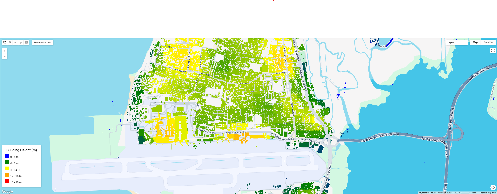

# Deriving Building Polygon Data in Google Earth Engine

## 1: Introduction

In hydraulic modeling, accurate building features is essential for further analyses, such as determining building height.
This step-by-step guide shows you how to:
1. Loading and clipping the Building Polygon V3 dataset (this can be done from the previous tutorial)
2. Loading and clipping the Building Height dataset
3. Visualizing the building data within your defined region of interest (ROI).
4. Exporting the final building polygon data with its height as additional features to your Drive.

This guide is the continuation step in utilizing building data for advanced analysis.

## 2: Material and Methods
### 2.1  Define Your Region of Interest (ROI)
To start, define your area of interest by either drawing a polygon directly in the Code Editor or importing a shapefile/FeatureCollection. 
If you draw two geometries [AREA and POINT] named geometry in the GEE panel, you can use them as follows:

Use (1) to first define your area and use (2) as an anchor in the map to zoom into your map.

### 2.2 Dive into the code
#### to extract the ROI based on the defined polygon
```javascript
// 1. Define ROI
var ROI       = ee.Geometry(geometry.geometries().get(1));
var pointGeom = ee.Geometry(geometry.geometries().get(0));
```

##### Load & Clip the data (Open Building V3)
Load and clip the building shape data, making sure to adjust the dataset selection as necessary:
```javascript
// 2.1 Load & clip the Building Shape Data
var buildings = ee.FeatureCollection('GOOGLE/Research/open-buildings/v3/polygons');
var buildings_ROI = buildings.filterBounds(ROI)
                          .filter('confidence >= 0.75'); // Add confidence for further filtering if needed
```
The confidence level can be used to filter the detections to achieve a certain precision level  
(1) confidence >= 0.65 && confidence < 0.7  
(2) confidence >= 0.7 && confidence < 0.75  
(3) confidence >= 0.75  
Please check the references for more information
```javascript
// 2.2 Load building height dataset and clip to ROI
var heightImage = ee.ImageCollection("JRC/GHSL/P2023A/GHS_BUILT_H")
                          .filterBounds(ROI)
                          .select('built_height')
                          .mean();  // Merge images into one
```
### Sampling the Height
```javascript
// 3. Calculate mean height for each building
var buildingsWithHeight = buildings_ROI.map(function(feature) {
  var meanHeight = heightImage.reduceRegion({
    reducer: ee.Reducer.mean(),
    geometry: feature.geometry(),
    scale: 30, // Adjust scale as needed for height dataset
    maxPixels: 1e9
  }).get('built_height'); //sampling band name in the dataset: built_height

  return feature.set('height', meanHeight || 0); // Defaulting to 0 if meanHeight is null
});
```
#### Visualize the Map
Use this to center your result every time you try to run for another trial 
```javascript
// 4. Defining the legend and color palette
// Define a color palette for height visualization
var palette = ['blue', 'green', 'yellow', 'orange', 'red'];
var visualizationImage = buildingsWithHeight.reduceToImage({
  properties: ['height'],
  reducer: ee.Reducer.first()
});

// 5. Visualizing and centering the map
Map.centerObject(pointGeom, 15);
Map.addLayer(visualizationImage, {
  min: 0,
  max: 20, // Adjusted range based on 0-20 meter scale (adjust it accordingly)
  palette: palette
}, 'Buildings with Variable Height');

//6. visualizing the legend
var legend = ui.Panel({
  style: {
    position: 'bottom-left',
    padding: '8px 15px'
  }
});
var legendTitle = ui.Label({
  value: 'Building Height (m)',
  style: {fontWeight: 'bold', fontSize: '18px'}
});
legend.add(legendTitle);
palette.forEach(function(color, index) {
  var step = 4; // Divide the color range into equal units for each bar
  var colorBox = ui.Label({
    style: {
      backgroundColor: color,
      padding: '10px',
      margin: '0 0 4px 0'
    }
  });
  var heightRange = (index * step) + ' - ' + ((index + 1) * step) + ' m';
  var legendRow = ui.Panel({
    widgets: [colorBox, ui.Label(heightRange)],
    layout: ui.Panel.Layout.Flow('horizontal')
  });
  legend.add(legendRow);
});

Map.add(legend);
```

#### Export the data to polygon (optional)
This optional step allows for exporting the resulting data to GIS software in GeoJSON format. The saved data will appear in your Google Drive under "EarthEngineExports". Ensure to adjust the coordinate system and spatial resolution as necessary.

```javascript

// 7. To Exports (OPTIONAL)
Export.table.toDrive({
  collection: buildingsWithHeight,
  description: 'Buildings_with_Height',
  folder: 'EarthEngineExports',
  fileFormat: 'GeoJSON'
});
```
## Final Results


## Reference
#### [1] W. Sirko, S. Kashubin, M. Ritter, A. Annkah, Y.S.E. Bouchareb, Y. Dauphin, D. Keysers, M. Neumann, M. Cisse, J.A. Quinn. Continental-scale building detection from high resolution satellite imagery. arXiv:2107.12283, 2021.  
Link: https://developers.google.com/earth-engine/datasets/catalog/GOOGLE_Research_open-buildings_v3_polygons#description
#### [2.1] Pesaresi, Martino; Politis, Panagiotis (2023): GHS-BUILT-H R2023A - GHS building height, derived from AW3D30, SRTM30, and Sentinel2 composite (2018). European Commission, Joint Research Centre (JRC)
#### [2.2] Pesaresi, Martino, Marcello Schiavina, Panagiotis Politis, Sergio Freire, Katarzyna Krasnodebska, Johannes H. Uhl, Alessandra Carioli, et al. (2024). Advances on the Global Human Settlement Layer by Joint Assessment of Earth Observation and Population Survey Data. International Journal of Digital Earth 17(1)
Link: https://developers.google.com/earth-engine/datasets/catalog/JRC_GHSL_P2023A_GHS_BUILT_H
